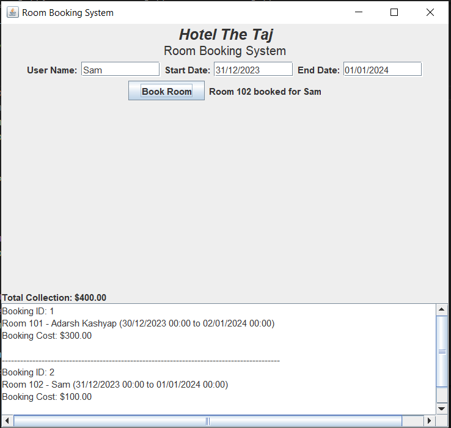

# Hotel The Taj Room Booking System

Welcome to the Hotel The Taj Room Booking System, a Java Swing application for managing room bookings. This application allows users to book rooms with their names, start and end dates, and provides real-time information about room availability and total collection.

## Features

- Book rooms with your name, start and end dates.
- Real-time availability check and room allocation.
- Display booking details, including room number, user name, date, and cost.
- Track the total collection from room bookings.

## Screenshot

## How to Use

1. Enter your name.
2. Select the start date and end date for your booking.
3. Click the "Book Room" button to make a booking.

## Author

- Adarsh Kashyap

## License

This project is open-source and available under the [MIT License](LICENSE).

Enjoy your stay at Hotel XYZ!
